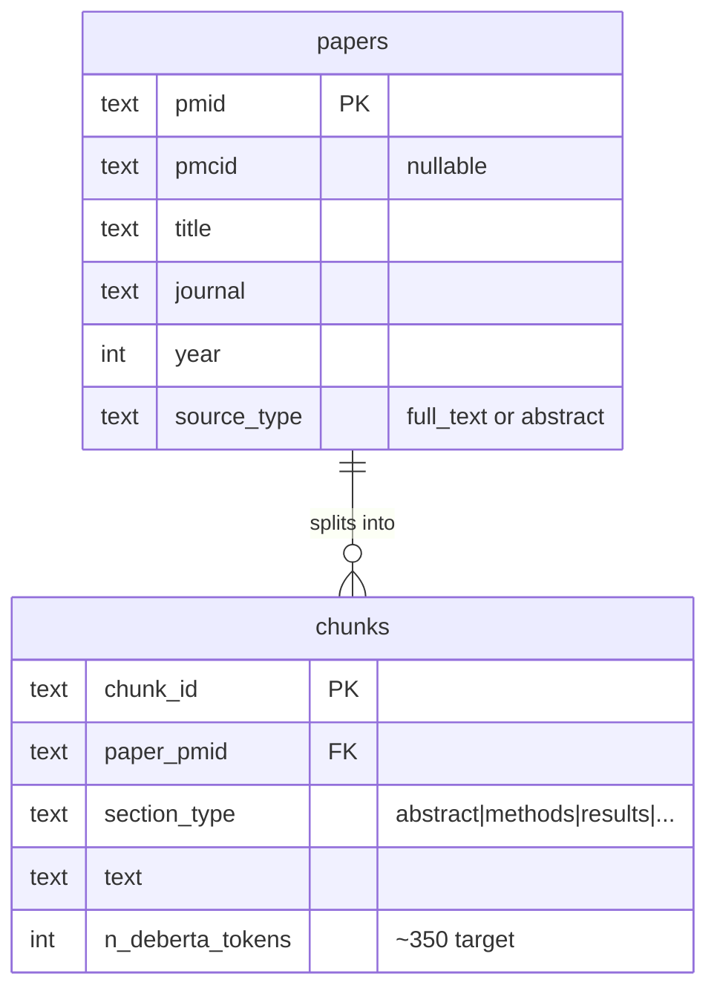
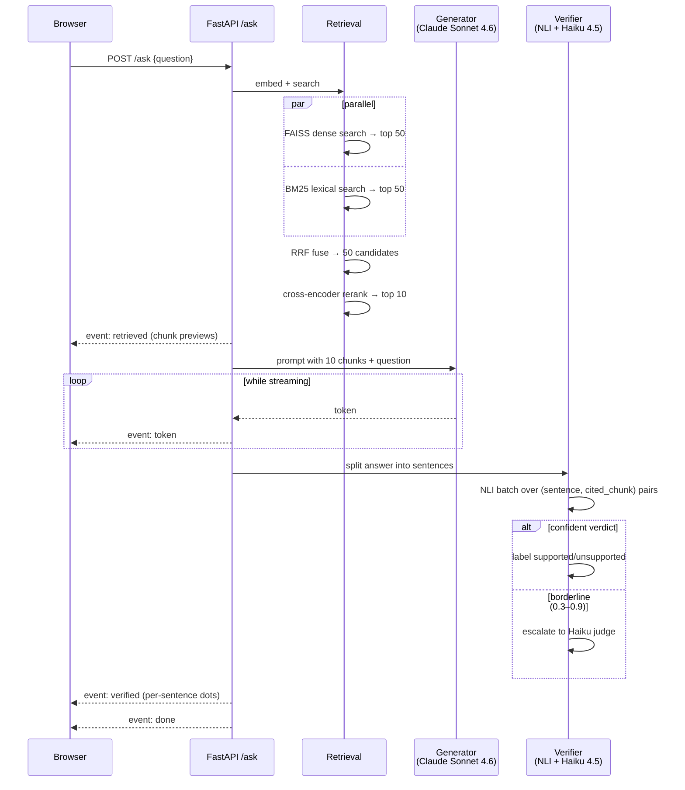
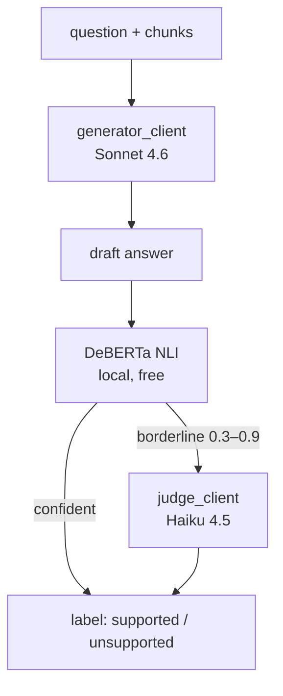

# rag-med — The 10-Minute Primer

A friendly on-ramp to this project. Read this when you've been away for a week and need to remember "wait, why does this exist and how do the pieces fit?"

> **This is not source of truth.** For locked design decisions go to `decisions.md`. For runtime behavior go to `architecture.md`. For vocabulary go to `glossary.md`. For a long narrative walkthrough go to `walkthrough.md`. This file is the on-ramp; those are the highway.

---

## 1. What this project is

A **search engine for pneumology research papers that explains its answers and proves the explanations are honest.**

Brother (MD/PhD, pneumology) types a clinical question. The system finds relevant passages from indexed papers, asks Claude to write an answer using only those passages, then checks every sentence of Claude's answer against the cited passages and paints each sentence green / yellow / red.

Three things make it not-just-another-RAG:

1. **Honest verified citations** — every claim is fact-checked post-hoc. Failures are surfaced, not hidden.
2. **Domain-aware backend** — chunking, embeddings, tokenization tuned for biomedical text (not generic ChatGPT-over-PDFs).
3. **Measured rigorously** — eval harness with retrieval + faithfulness metrics on a real domain-expert gold set.

---

## 2. The three stages

Three separate programs, sharing one codebase under `src/rag_med/`. They never import each other — they share via `shared/`.

```mermaid
flowchart LR
  subgraph P1["Phase 1 — Indexing (dev machine, runs once)"]
    PubMed[PubMed + PMC] --> Bundle[bundle.tar.gz<br/>SQLite + FAISS + BM25]
  end

  subgraph P2["Phase 2 — Serving (brother's machine, always-on)"]
    Q[brother's question] --> Pipe[retrieve → generate → verify]
    Pipe --> A[verified answer]
  end

  subgraph P3["Phase 3 — Eval (dev machine, on demand)"]
    GS[gold set] --> Metrics[Recall@10, Faithfulness, Latency]
  end

  Bundle -.->|brother downloads<br/>~10 GB, ~15 min| Pipe
  Pipe -.->|same code,<br/>direct import| Metrics
```

| Phase | When | Why it exists |
|---|---|---|
| **Indexing** | Once on dev's M5 Pro (~4–6 h) | Build the search index from PubMed/PMC, ship as a bundle to HuggingFace |
| **Serving** | Always-on on brother's i7-155H | Answer questions with verified citations |
| **Eval** | On demand during development | Measure whether changes made retrieval/faithfulness better or worse |

---

## 3. The data model

Two main entities. `paper` is the unit of provenance ("where did this come from"). `chunk` is the unit of search ("what gets retrieved").

> **Vocabulary note.** The glossary bans the word `article` — always say `paper`. Always say `question`, not `query`. A list of every banned synonym lives in `glossary.md`.



### `papers` table

| column | type | meaning |
|---|---|---|
| `pmid` | TEXT PK | PubMed ID — universal, always present |
| `pmcid` | TEXT | PMC ID — only ~30% of corpus (full-text papers) |
| `doi` | TEXT | for display + linking out |
| `title` | TEXT | paper title |
| `journal` | TEXT | e.g. "NEJM" |
| `year` | INT | publication year |
| `source_type` | TEXT | `full_text` (we have body) or `abstract` (we have only the abstract) |
| `mesh_terms_json` | TEXT | MeSH controlled vocabulary tags |
| `fetched_at` | TEXT | when we pulled it from NCBI |

**Example row:** `pmid=17314337, title="Salmeterol and fluticasone propionate and survival in COPD", journal="NEJM", year=2007, source_type="full_text"` — that's the TORCH trial.

### `chunks` table

| column | type | meaning |
|---|---|---|
| `chunk_id` | TEXT PK | format: `{pmid}_{section_type}_{ordinal}` |
| `paper_pmid` | TEXT FK | which paper this chunk came from |
| `section_type` | TEXT | `abstract` \| `introduction` \| `methods` \| `results` \| `discussion` \| `table` \| `caption` \| `other` |
| `text` | TEXT | the actual chunk text (~350 DeBERTa tokens) |
| `n_deberta_tokens` | INT | canonical size — verifier has 512-token cap, so we size against the strictest tokenizer |
| `n_medcpt_tokens` | INT | sanity check — different tokenizer, just for forensics |

**Example row:** `chunk_id="17314337_methods_03", section_type="methods", text="Patients were randomized to salmeterol 50 µg plus fluticasone 500 µg twice daily..."`.

One paper → ~15–40 chunks. Total corpus at M5 ≈ 200–250k chunks across ~150k papers.

---

## 4. The serving flow — one `/ask` request

This is the most important diagram in the doc. Trace one question — *"What is the FEV1 decline rate in COPD on triple therapy?"* — from click to verified answer.



The whole thing takes ~10–15 s typical, ≤20 s at p95. Brother sees text streaming by t ≈ 1 s, finished answer by t ≈ 8 s, color dots painted by t ≈ 13 s.

---

## 5. The two LLM roles

Claude plays two **distinct** roles using two **distinct** models. They have separate API clients in the code (`generator_client`, `judge_client`) — never merged. Why? Cost.

| Role | Model | Where | Streaming? | Cost/query |
|---|---|---|---|---|
| **generator** | Claude Sonnet 4.6 | writes the answer | yes (token-by-token SSE) | ~$0.018 |
| **judge** | Claude Haiku 4.5 | resolves borderline verifier cases | no (one-shot) | ~$0.004 avg |



Why two models? Sonnet's prose quality matters when generating the answer. The judge task is binary entailment over short text — Haiku is plenty, ~3× cheaper, ~3× faster. Locked in `decisions.md §Q16`.

---

## 6. The verifier — the differentiator

After Claude writes the answer, the verifier splits it into sentences and checks each one against its cited chunks. **The original answer is never edited** — instead, each sentence gets a colored dot signaling whether to trust it.

```mermaid
flowchart TD
  S["sentence with citations [1][3]"] --> Parse[parse_citations]
  Parse --> Resolve[resolve [n] → chunk_id]
  Resolve --> Check{any [n] not in<br/>final_chunks?}
  Check -->|yes| Fab["red dot<br/>failure_kind=<br/>fabricated_citation"]
  Check -->|no| NoCite{sentence has<br/>no [n] at all?}
  NoCite -->|yes| NoCit["red dot<br/>failure_kind=<br/>no_citation"]
  NoCite -->|no| NLI[NLI on each<br/>sentence,chunk pair]
  NLI --> Score{entailment<br/>score?}
  Score -->|≥ 0.9| Green[green dot<br/>supported]
  Score -->|contradiction ≥ 0.9| Red[red dot<br/>nli_contradiction]
  Score -->|0.3–0.9 borderline| Haiku[Haiku judge]
  Haiku --> Final[supported / unclear / unsupported]
```

| Color | Status | What it means |
|---|---|---|
| 🟢 green | `supported` | NLI or judge confirms the cited chunk backs the claim |
| 🟡 yellow | `unclear` | borderline — can't tell either way |
| 🔴 red | `unsupported` | cited chunk does NOT back the claim, OR Claude fabricated a citation number, OR Claude skipped citing |
| ⚪ gray | `unknown` | the verifier itself crashed |

A sentence with `[1][3]` is checked as **two** pairs — `(sentence, chunk_1)` AND `(sentence, chunk_3)`. Both must entail for green. This catches Claude over-citing (e.g., slapping `[3]` on a claim only `[1]` supports). Locked as "AND-of-singles" in `decisions.md §Q9`.

---

## Where to go next

| If you want to know… | Read… |
|---|---|
| **Why** we picked X over Y | `decisions.md` |
| **How** the runtime behaves under load / failure | `architecture.md` |
| **What** to call something in code/logs (canonical names + banned synonyms) | `glossary.md` |
| **Plain-English narrative** with analogies (RAG explained from first principles) | `walkthrough.md` |
| **What I'm building this week** | `../../steps/week1.md` |
| **Current state of the project** | `../../PROGRESS.md` |
